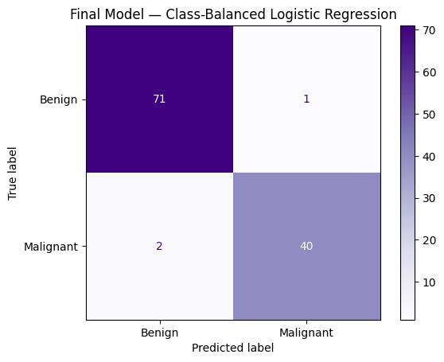
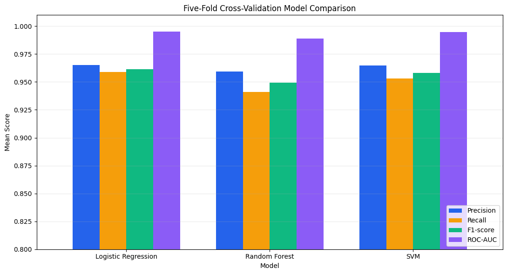

# Breast Cancer Wisconsin Classification

An end-to-end binary-classification project using the Breast Cancer Wisconsin (Diagnostic) dataset. Logistic Regression, Random Forest and support vector machine (SVM) models are compared using stratified cross-validation, held-out testing, ROC-AUC analysis, confusion matrices and feature importance.

## Objective

The goal is to classify breast tumours as **benign** or **malignant**, with particular attention to false negatives—malignant cases incorrectly predicted as benign.

> This is an educational machine-learning project. The models are not validated for clinical diagnosis or medical decision-making.

## Final model

**Class-balanced Logistic Regression with the default 0.50 decision threshold** was selected as the final model. It ranked first across all reported five-fold cross-validation metrics and missed only 2 of the 42 malignant cases in the held-out test set.

| Held-out test metric | Result |
|---|---:|
| Accuracy | **97.37%** |
| Precision | **97.56%** |
| Recall | **95.24%** |
| F1-score | **96.39%** |
| ROC-AUC | **99.54%** |
| False negatives | **2** |

<table>
  <tr>
    <th align="center">Final Confusion Matrix</th>
    <th align="center">Five-Fold Cross-Validation</th>
  </tr>
  <tr>
    <td align="center"></td>
    <td align="center"></td>
  </tr>
</table>

## Dataset

- Dataset: Breast Cancer Wisconsin (Diagnostic)
- Source: [Kaggle / UCI Machine Learning](https://www.kaggle.com/datasets/uciml/breast-cancer-wisconsin-data)
- Samples: 569
- Predictive features: 30 numerical measurements
- Target: `diagnosis`
  - `0` = benign
  - `1` = malignant
- Class distribution:
  - Benign: 357
  - Malignant: 212

The identifier column `id` and empty column `Unnamed: 32` were removed because they are not predictive measurements.

## Methodology

1. Inspected and cleaned the dataset.
2. Encoded benign as `0` and malignant as `1`.
3. Created an 80/20 stratified train-test split using `random_state=42`.
4. Built leakage-safe pipelines that perform scaling inside each validation fold.
5. Compared class-balanced Logistic Regression, Random Forest and RBF-kernel SVM using five-fold stratified cross-validation.
6. Selected the strongest model using recall, F1-score and ROC-AUC rather than accuracy alone.
7. Generated out-of-fold probabilities to test decision-threshold tuning without selecting a threshold directly on the test set.
8. Evaluated the final model once on the untouched test set.

## Five-fold cross-validation results

The following values are mean validation scores calculated using only the training partition.

| Model | Accuracy | Precision | Recall | F1-score | ROC-AUC |
|---|---:|---:|---:|---:|---:|
| **Logistic Regression** | **97.14%** | **96.50%** | **95.88%** | **96.16%** | **99.54%** |
| SVM | 96.92% | 96.46% | 95.29% | 95.83% | 99.48% |
| Random Forest | 96.26% | 95.92% | 94.12% | 94.95% | 98.91% |

Logistic Regression achieved the highest mean score for every reported metric. SVM was a close second, while Random Forest ranked third.

## Threshold analysis

The Logistic Regression decision threshold was tuned using out-of-fold training probabilities. Increasing the threshold from `0.50` to `0.620` worsened malignant recall and increased false negatives, so the default threshold was retained.

| Threshold | Precision | Recall | F1-score | False negatives |
|---|---:|---:|---:|---:|
| **Default (0.50)** | **97.56%** | **95.24%** | **96.39%** | **2** |
| Tuned (0.620) | 97.50% | 92.86% | 95.12% | 3 |

## Initial model comparison

The first experiment compared standard Logistic Regression and Random Forest on the held-out test set. Class balancing and cross-validation were subsequently added to make the final selection more rigorous.

<table>
  <tr>
    <th align="center">Initial Logistic Regression</th>
    <th align="center">Random Forest</th>
  </tr>
  <tr>
    <td align="center"></td>
    <td align="center"></td>
  </tr>
</table>

## ROC curve and feature importance

<table>
  <tr>
    <th align="center">Initial ROC Curve Comparison</th>
    <th align="center">Random Forest Feature Importance</th>
  </tr>
  <tr>
    <td align="center"></td>
    <td align="center"></td>
  </tr>
</table>

The five leading Random Forest features were:

| Rank | Feature | Importance |
|---:|---|---:|
| 1 | `perimeter_worst` | 0.1435 |
| 2 | `area_worst` | 0.1408 |
| 3 | `concave points_worst` | 0.1046 |
| 4 | `concave points_mean` | 0.0996 |
| 5 | `radius_worst` | 0.0750 |

Feature importance describes predictive contribution within this fitted Random Forest; it does not establish medical causation. Correlated measurements may also share or distort importance.

## Technologies

- Python
- NumPy
- Pandas
- Matplotlib
- Seaborn
- scikit-learn
- Google Colab

## Repository structure

```text
breast-cancer-wisconsin-classification/
├── breast_cancer_wisconsin_classification.ipynb
├── LICENSE
├── README.md
├── requirements.txt
└── images/
    ├── class_balanced_logistic_regression.png
    ├── cross-validation-barchart.png
    ├── logistic_confusion_matrix.png.png
    ├── random_forest_confusion_matrix.png.png
    ├── random_forest_feature_importance.png.png
    └── roc curve comparison.png
```

The dataset is not redistributed in this repository. Download `data.csv` from the linked dataset page and upload it to the Colab session before running the notebook.

## Installation

```bash
git clone https://github.com/div12-space/breast-cancer-wisconsin-classification.git
cd breast-cancer-wisconsin-classification
pip install -r requirements.txt
```

Alternatively, open the notebook in Google Colab and run all cells from top to bottom.

## Limitations

- The dataset contains only 569 samples.
- No independent external clinical dataset was used.
- Hyperparameter selection was limited rather than exhaustive.
- Feature importance is affected by correlated predictors.
- Strong benchmark performance does not demonstrate clinical validity.

## Future improvements

- Add repeated stratified cross-validation with confidence intervals.
- Tune model hyperparameters using nested cross-validation.
- Compare probability calibration across models.
- Evaluate the final pipeline on an independent dataset.

## Author

**Divyanshu Beniwal**  
B.Tech Data Science student
