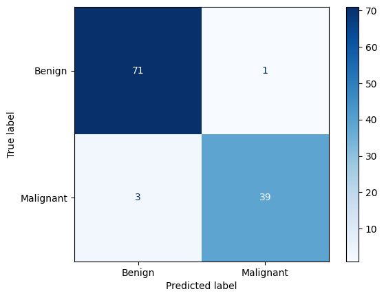
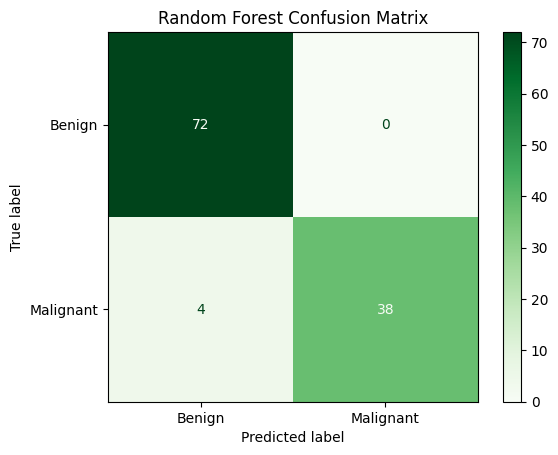
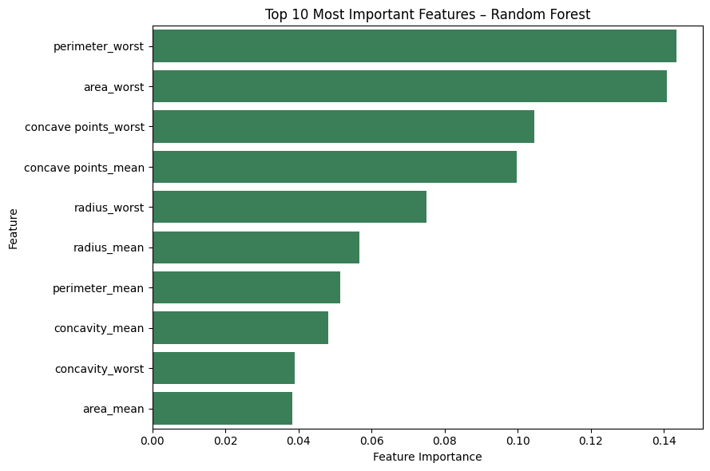

# Breast Cancer Wisconsin Classification

This project classifies breast tumours as **benign** or **malignant** using the Breast Cancer Wisconsin (Diagnostic) dataset. It compares Logistic Regression and Random Forest using accuracy, precision, recall, F1-score, ROC-AUC, confusion matrices, and feature importance.

## Project objective

The goal is to build and compare supervised machine-learning models while focusing on a clinically important error: predicting a malignant tumour as benign (a false negative).

> This is an educational machine-learning project. The models are not validated for clinical diagnosis or medical decision-making.

## Model visualisations

<table>
  <tr>
    <th align="center">Logistic Regression</th>
    <th align="center">Random Forest</th>
  </tr>
  <tr>
    <td align="center"></td>
    <td align="center"></td>
  </tr>
</table>

<table>
  <tr>
    <th align="center">ROC Curve Comparison</th>
    <th align="center">Random Forest Feature Importance</th>
  </tr>
  <tr>
    <td align="center"></td>
    <td align="center"></td>
  </tr>
</table>

## Dataset

- Dataset: Breast Cancer Wisconsin (Diagnostic)
- Source: [Kaggle / UCI Machine Learning](https://www.kaggle.com/datasets/uciml/breast-cancer-wisconsin-data)
- Samples: 569
- Predictive features: 30 numerical measurements
- Target: `diagnosis`
  - `0` = benign
  - `1` = malignant
- Class distribution:
  - Benign: 357
  - Malignant: 212

The `id` and empty `Unnamed: 32` columns were removed because they are not predictive measurements.

## Workflow

1. Loaded and inspected the dataset.
2. Removed irrelevant columns.
3. Encoded the diagnosis labels.
4. Created an 80/20 stratified train-test split using `random_state=42`.
5. Standardized features for Logistic Regression using statistics learned only from the training data.
6. Trained Logistic Regression and class-balanced Random Forest models.
7. Evaluated both models with classification metrics and confusion matrices.
8. Compared ROC curves and examined Random Forest feature importance.

## Model results

| Model | Accuracy | Precision | Recall | F1-score | ROC-AUC | False negatives |
|---|---:|---:|---:|---:|---:|---:|
| Logistic Regression | 96.49% | 97.50% | **92.86%** | **95.12%** | 99.60% | **3** |
| Random Forest | 96.49% | **100.00%** | 90.48% | 95.00% | **99.70%** | 4 |

## Model selection

Logistic Regression was selected as the preferred model at the default classification threshold. Both models achieved the same accuracy, while Random Forest had marginally higher ROC-AUC and perfect precision. However, Logistic Regression detected a larger proportion of malignant cases and produced one fewer false negative.

Because false negatives are the more serious error in this task, malignant recall was prioritised over the tiny ROC-AUC difference.

## Most important Random Forest features

| Rank | Feature | Importance |
|---:|---|---:|
| 1 | `perimeter_worst` | 0.1435 |
| 2 | `area_worst` | 0.1408 |
| 3 | `concave points_worst` | 0.1046 |
| 4 | `concave points_mean` | 0.0996 |
| 5 | `radius_worst` | 0.0750 |

These values describe predictive contribution within the fitted Random Forest. They do not establish medical causation, and correlated measurements can share or distort importance.

## Technologies

- Python
- NumPy
- Pandas
- Matplotlib
- Seaborn
- scikit-learn
- Google Colab

## Repository structure

```text
breast-cancer-wisconsin-classification/
├── breast_cancer_wisconsin_classification.ipynb
├── LICENSE
├── README.md
├── requirements.txt
└── images/
    ├── logistic_confusion_matrix.png.png
    ├── random_forest_confusion_matrix.png.png
    ├── random_forest_feature_importance.png.png
    └── roc curve comparison.png
```

The dataset is not included in the repository. Download `data.csv` from the linked dataset page and upload it to the Colab session before running the notebook.

## Installation

```bash
git clone https://github.com/div12-space/breast-cancer-wisconsin-classification.git
cd breast-cancer-wisconsin-classification
pip install -r requirements.txt
```

Alternatively, open the notebook in Google Colab and run its cells from top to bottom.

## Limitations

- The dataset contains only 569 samples.
- Results come from one 80/20 train-test split.
- No independent external clinical dataset was used.
- Feature importance is affected by correlated predictors.
- High performance on this dataset does not demonstrate clinical validity.

## Future improvements

- Add repeated stratified cross-validation.
- Tune hyperparameters using only training folds.
- Analyse precision-recall curves and decision thresholds.
- Compare calibrated probability estimates.
- Evaluate the final model on an independent dataset.

## Author

**Divyanshu Beniwal**  
B.Tech Data Science student
